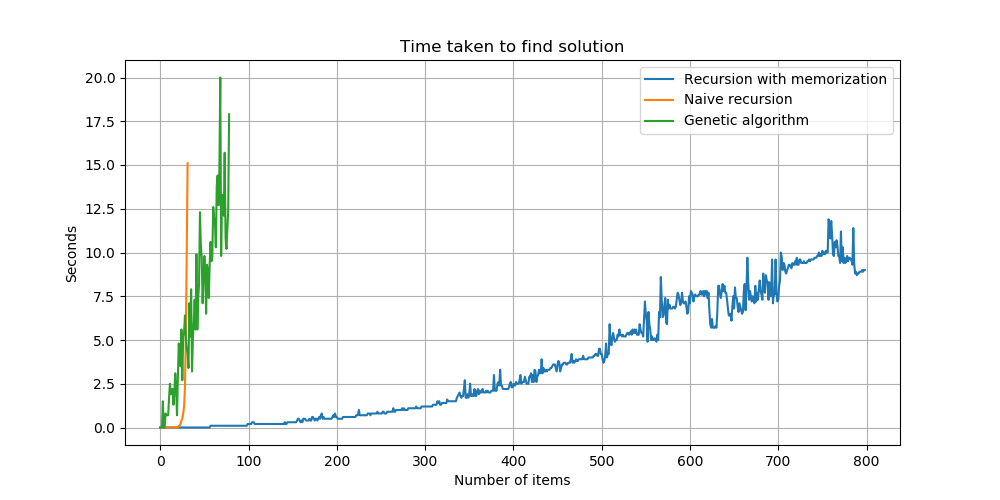

# knapsack-problem-py
Yet another repository for knapsack problem in python.

There are 2 ways to look at this problem:
- Decision (NP-Complete) Can a value of at least V be achieved without exceeding the weight W?
- Optimization (NP-Hard). Find best value without exceeding the weight W.

Very good explanation of a problem is in Wikipedia
https://en.wikipedia.org/wiki/Knapsack_problem

There is no known algorithm which solves this problem in polynomial time.

## Algorithms 

This repository contains implementation of few most popular **optimization** algorithms

### Naive recursive

This implementation tries all combinations, which is bad idea for big dataset.

Complexity is exponential **(2^n)** where n is number of items.

```
python3 naive_recursive.py
```

### Recursive with memory

This implementation is same as naive recursion but it has one improvement. Intermediate results are stored in memory and same recursion branch is not computed twice.
This minor improvement proves to have significant impact on computing time reduction.


```
python3 memo_recursive.py
```

### Genetic Evolutionary Algorithm

This is an implementation of approximation algorithm. That means you can't be sure if global optimal solution is found.

```
python3 genetic_algorithm.py
```

## Results

naive recursive algoritm requires exponential time

genetic algorithm does not show awesome results as well (probably highly depends on crossover strategy)

recursive with memory shows best results and compiting time increases slowly



## Dataset
`dataset.json` contains 800+ items

#### Definition
values - item values

weights - item weights

bests - best value of items using n items (n is current index)

capacities - knapsack capacity for n items (n is current index)

#### Example
for example lets take first 5 items

values = [72, 69, 39, 11, 47]

weights = [77, 47, 2, 71, 58]

bests = [0, 0, 39, 108, 108]

capacities = [22, 32, 42, 55, 57]

n = 0 | best = 0, because first item weights 77 which is bigger than capacity 22

n = 1 | best = 0, because first 2 items weight [72 or 69] which is bigger than capacity 32

n = 2 | best = 39, because item 3 (value = 39, weight = 2) and it fits into capacity of 42

n = 3 | best = 108, because both item 2 (value = 69, weigth 47) and item 3 (value = 39, weight = 2) fit into capacity of 55

n = 4 | best = 108, because both item 2 (value = 69, weigth 47) and item 3 (value = 39, weight = 2) fit into capacity of 57
